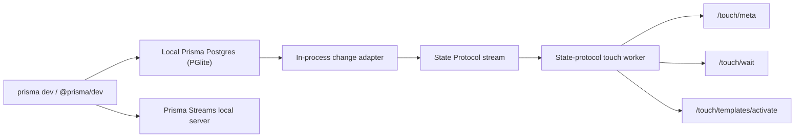

# Prisma Dev + Prisma Streams Live Integration

This document describes how to run Prisma Streams alongside local Prisma Postgres
(`prisma dev` / `@prisma/dev`) so Live is always enabled and fed from
the local PGlite-backed database.

For the generic live integration model, request shapes, and `/touch/*`
API contract, start with [`./live.md`](./live.md). This document focuses on
the Prisma local-development embedding story.

Important:

- the official Prisma programmatic local-dev API is currently documented as
  unstable / undocumented
- treat exact `@prisma/dev` entrypoint names and options as subject to change
- the integration shape in this document is the intended architecture, not a
  promise about a frozen Prisma API name

## Goal

Target behavior:

- `prisma dev` always starts a colocated Prisma Streams local server
- the local streams server runs with no credentials and no remote object store
- the live system is enabled by default
- all committed local database changes are forwarded into a Durable Stream
- the setup works from both Bun and Node-based Prisma tooling

## Current Support

### Supported now

- Prisma Streams local mode is fully local:
  - single SQLite database
  - no segmenting
  - no object-store uploads
  - no credentials required
- Live works in local mode.
- The intended live-query flow works locally:
  - `POST /v1/stream/<stream>/touch/templates/activate`
  - `GET /v1/stream/<stream>/touch/meta`
  - `POST /v1/stream/<stream>/touch/wait`
- State Protocol ingest is supported today.
- The local server transport has both:
  - Bun runtime support via `Bun.serve`
  - Node runtime support via `node:http`

### Not built in yet

- Prisma Streams does not include a built-in PGlite WAL/change adapter.
- Live does not consume raw PostgreSQL WAL bytes directly.
  - Adapters must map database change events into Durable Streams State Protocol.
- Prisma Streams still does not include a built-in `@prisma/dev` integration.
  - The published `@tungthedev/streams-local` package is package-tested under Node and Bun, including the live `/touch/*` path.
  - The Prisma-owned adapter and lifecycle wiring still need to be implemented.

## Important Constraint: Use An In-Process Adapter

Local Prisma Postgres is currently documented as accepting one connection at a
time. That means Prisma Streams should not try to ingest database changes by
opening a second Postgres connection or a separate replication client.

The correct integration point is inside `prisma dev` / `@prisma/dev` itself:

- start the local Prisma Postgres server
- start the local Prisma Streams server in the same process
- hook into the local PGlite change stream / WAL event source directly
- forward committed changes into Prisma Streams over HTTP

This keeps the database at one active connection while still enabling live
query invalidation.

## Recommended Architecture



Recommended ownership:

- `@prisma/dev` owns lifecycle of both local services
- Prisma Streams stays database-agnostic
- the Prisma-owned adapter maps PGlite events into State Protocol

## Stream Model

Create one Durable Stream per local Prisma Postgres instance for change ingest.

Suggested stream name:

- `prisma-dev.wal`

or, if you want explicit namespacing by local instance:

- `<instance-name>.wal`

The stream content type should be:

- `application/json`

The `state-protocol` profile should be installed once at startup:

```json
{
  "apiVersion": "durable.streams/profile/v1",
  "profile": {
    "kind": "state-protocol",
    "touch": {
      "enabled": true,
      "onMissingBefore": "coarse"
    }
  }
}
```

Recommended shape:

- fully local
- no object store
- best fit for local dev invalidation

## State Protocol Mapping

Prisma Streams Live consumes State Protocol records, not raw WAL.

Each committed database change should be normalized into a JSON record like:

```json
{
  "type": "public.posts",
  "key": "42",
  "value": { "id": 42, "userId": "u1", "title": "Hello" },
  "old_value": { "id": 42, "userId": "u0", "title": "Hello" },
  "headers": {
    "operation": "update",
    "txid": "12345",
    "timestamp": "2026-03-16T12:00:00.000Z"
  }
}
```

Mapping guidance:

- insert:
  - `headers.operation = "insert"`
  - `value = row after`
  - `old_value = null` or omitted
- update:
  - `headers.operation = "update"`
  - `value = row after`
  - `old_value = row before`
- delete:
  - `headers.operation = "delete"`
  - `value = null`
  - `old_value = row before`

Field meanings:

- `type`
  - use a stable entity identifier like `<schema>.<table>`
- `key`
  - use a stable logical row identifier
  - primary key string is the simplest choice
- `value`
  - after image
- `old_value`
  - before image
- `headers.timestamp`
  - commit or event timestamp in RFC3339
- `headers.txid`
  - commit/transaction id if available

## Why `old_value` Matters

The live system can operate without `old_value`, but update invalidation becomes
less precise.

Recommended policy:

- if the PGlite hook can always provide before-images, use them
- if before-images are not always available, start with:
  - `touch.onMissingBefore = "coarse"`

That preserves correctness by falling back to coarse invalidation.

If you can guarantee before-images for all updates, you can later tighten to:

- `touch.onMissingBefore = "error"`

## Startup Sequence

At Prisma dev startup:

1. Start the local Prisma Postgres server.
2. Start the local Prisma Streams server with the same logical instance name.
3. Ensure the ingest stream exists.
4. Install the `state-protocol` profile.
5. Attach the in-process PGlite change adapter.
6. Forward all committed changes into Prisma Streams.

## Programmatic Sketch

This is the intended shape, not a copy-paste-ready Prisma implementation:

```ts
import { startPrismaDevServer } from "@prisma/dev";
import { startLocalDurableStreamsServer } from "@tungthedev/streams-local";

async function startPrismaDevWithLive(name: string) {
  const prisma = await startPrismaDevServer({
    name,
    persistenceMode: "stateful",
  });

  const streams = await startLocalDurableStreamsServer({
    name,
    hostname: "127.0.0.1",
    port: 0,
  });

  const baseUrl = streams.exports.http.url;
  const stream = `${name}.wal`;

  await fetch(`${baseUrl}/v1/stream/${encodeURIComponent(stream)}`, {
    method: "PUT",
    headers: {
      "content-type": "application/json",
    },
  });

  await fetch(`${baseUrl}/v1/stream/${encodeURIComponent(stream)}/_profile`, {
    method: "POST",
    headers: {
      "content-type": "application/json",
    },
    body: JSON.stringify({
      apiVersion: "durable.streams/profile/v1",
      profile: {
        kind: "state-protocol",
        touch: {
          enabled: true,
          onMissingBefore: "coarse",
        },
      },
    }),
  });

  const stopChangeHook = attachPGliteChangeHook(prisma, async (change) => {
    const event = mapPGliteChangeToStateProtocol(change);
    await fetch(`${baseUrl}/v1/stream/${encodeURIComponent(stream)}`, {
      method: "POST",
      headers: {
        "content-type": "application/json",
      },
      body: JSON.stringify(event),
    });
  });

  return {
    prisma,
    streams,
    stream,
    async close() {
      await stopChangeHook?.();
      await streams.close();
      await prisma.close?.();
    },
  };
}
```

## Adapter Responsibilities

The Prisma-owned adapter should:

- observe committed local database changes
- group or order them consistently with commit order
- normalize each change into State Protocol
- avoid emitting uncommitted or rolled-back changes
- preserve before-images when available
- serialize append delivery to keep the stream order aligned with commit order

Minimal contract for the adapter:

- no additional database connection
- no dependence on remote infra
- no credentials
- deterministic event ordering per local instance

## Consumer Contract

Query consumers should treat Prisma Streams as an invalidation service:

1. Run the actual query against the local database.
2. Compute the relevant table key and optional template/watch keys.
3. Call `/touch/wait`.
4. Re-run the query when touched.

Do not try to read query results out of Prisma Streams.

## Bun And Node

Intended target:

- Bun-based Prisma tooling can start the local Prisma Streams server directly.
- Node-based Prisma tooling should also be able to start the same local server.

Current repo status:

- the published `@tungthedev/streams-local` package surface is built for Node and Bun
- the full self-hosted server remains Bun-only
- the remaining work is the Prisma-owned adapter and lifecycle integration in
  `prisma dev` / `@prisma/dev`

## Recommended Next Changes In This Repo

1. Keep package smoke coverage that starts the local server under both Node and Bun and exercises:
   - `/_profile`
   - `/touch/meta`
   - `/touch/templates/activate`
   - `/touch/wait`
2. Add a small example adapter contract doc for mapping database changes into
   State Protocol.
3. Keep the touch config minimal and memory-journal based.

## Bottom Line

This plan is architecturally aligned with the current Prisma Streams design.

What is already supported:

- fully local operation
- no credentials
- live query invalidation in local mode
- State Protocol ingest
- memory-backed touch mode suitable for local development

What still needs to be added around it:

- the PGlite-to-State-Protocol adapter in `prisma dev` / `@prisma/dev`
- the Prisma-owned lifecycle wiring that starts and supervises both local services

## References

- Prisma local development docs:
  - https://www.prisma.io/docs/postgres/database/local-development#manage-local-prisma-postgres-programmatically
- Prisma Streams live semantics:
  - ./live.md
- Prisma Streams local server:
  - ./local-dev.md
